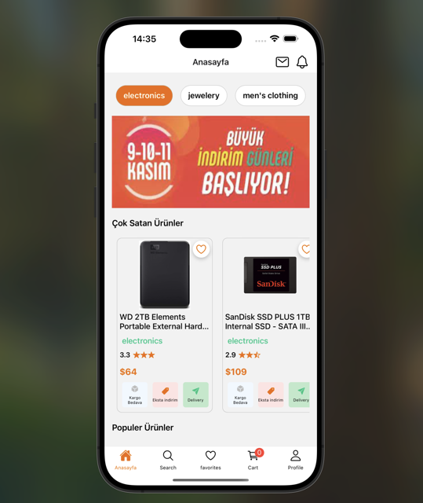
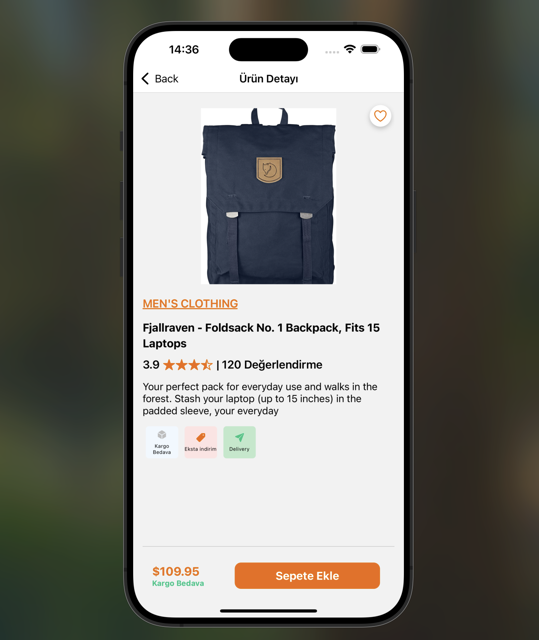
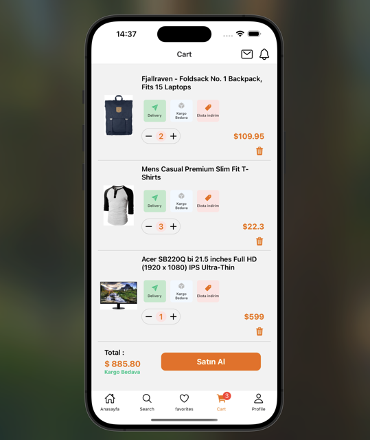
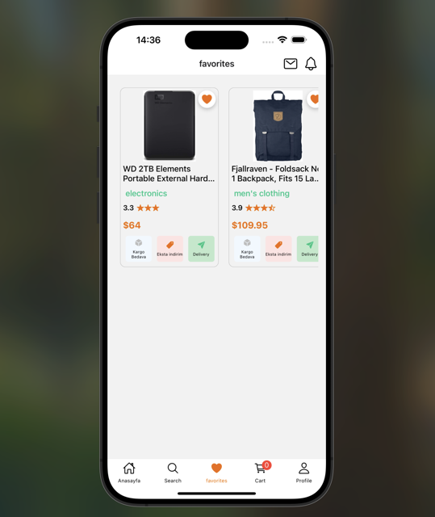
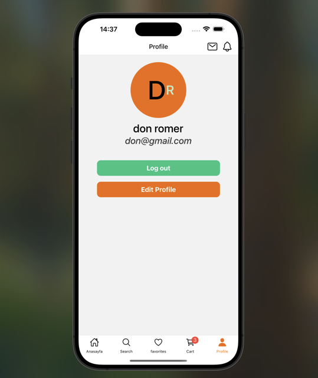
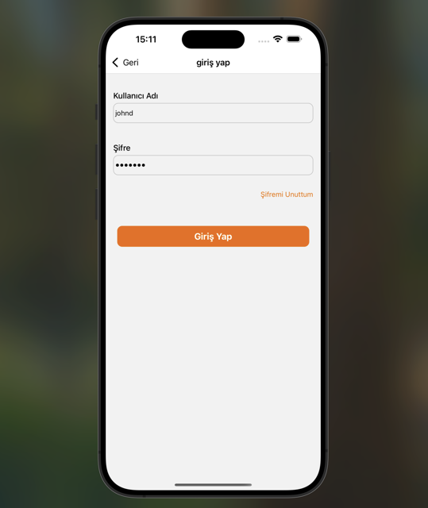

# 🛍️ Trendyol Clone (React Native & TypeScript)

This project is a **Trendyol clone** developed using **React Native and TypeScript**.  
It allows users to add and remove products from the favorites and cart, as well as handle authentication processes.  
The backend is powered by **Fake API Store**.

---

## 📸 Screenshots

### 📹 Video GIF


### 🏠 Home Screen



### 🩳 AllProducts Screen


### 👔 Product Detail Screen



### 🛒 Cart Screen



### ❤️ Favorites Screen



### 👨‍🏫 Profile Screen



### 🔐 Login Screen



---

## 🚀 Features

- ✅ **Product Listing** – Fetching and displaying products from the Fake API
- ✅ **Add/Remove from Cart** – Users can add and remove products from their cart
- ✅ **Add/Remove from Favorites** – Users can add and remove products from their favorites
- ✅ **Authentication (Authorization)** – Login and logout functionality
- ✅ **React Navigation Integration** – Seamless navigation between screens
- ✅ **Global State Management with Redux Toolkit**

---

## 🛠️ Technologies & Libraries Used

| Technology/Library                   | Description                       |
| ------------------------------------ | --------------------------------- |
| **React Native** (v0.78.0)           | Mobile app development framework  |
| **TypeScript**                       | For safer and scalable code       |
| **Redux Toolkit** (@reduxjs/toolkit) | State management solution         |
| **React Navigation**                 | For screen navigation and routing |
| **Axios**                            | For making HTTP requests          |
| **Formik & Yup**                     | Form handling and validation      |
| **Async Storage**                    | Local storage for user data       |
| **React Native Vector Icons**        | To include custom icons           |

---

## 📦 Installation

Clone the project and install dependencies:

```bash
git clone https://github.com/ozerbaykal/ReactNativeTrendyol.git
cd trendyol-clone
npm install  # or yarn install

📱 Running the App

For Android:
npx react-native run-android

For iOS:
npx react-native run-ios

Note: For iOS, don't forget to run:
cd ios && pod install

```

## 🔧 Project Structure

/trendyol-clone
│── src
│ ├── components # Reusable UI components
│ ├── screens # Screens (Home, Cart, Favorites, Login, etc.)
│ ├── navigation # React Navigation setup
│ ├── store # Redux Toolkit Store & Slices
│ ├── services # API requests (Axios)
│ ├── utils # Utility functions
│ ├── assets # Images, icons, etc.
│── App.tsx # Main application file
│── package.json # Dependencies
│── README.md # Project documentation

## 🖥️ API Usage

his project uses Fake API Store as a backend. Below are the main endpoints:

- Get All Products: https://fakestoreapi.com/products
- Get Single Product: https://fakestoreapi.com/products/{id}
- Login: https://fakestoreapi.com/auth/login

## 📌 Future Updates

- 🚀 Planned features:

- 🛒 Payment Integration
- 🌎 Multi-language Support
- 🌙 Dark Mode

## Developer

Özer Baykal

## ✨ Contributions

Contributions are welcome! Please open an issue first to discuss what you would like to change.

- 1.Fork the project
- 2.Create your feature branch (git checkout -b feature/NewFeature)
- 3.Commit your changes (git commit -m 'Add new feature')
- 4.Push to the branch (git push origin feature/NewFeature)
- 5.Open a Pull Request

## Contact 📬

**Özer BAYKAL**  
Email: [baykalozer87@gmail.com](mailto:baykalozer87@gmail.com)  
Project Link: [nativeTrendyol](https://github.com/ozerbaykal/ReactNativeTrendyol)
